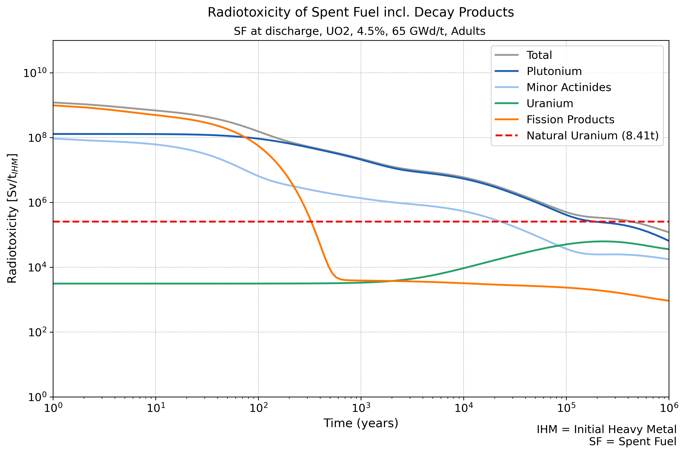

# RaToViTo - Radiotoxicity Visualization Tool
RaToViTo is a tool designed to simulate the evolution of isotope inventories in radioactive waste over time using a decay-only simulation approach powered by the open-source code OpenMC in order to calculate radiotoxicities based on dose conversion coefficients for different age groups for the purpose of visualizing the results in comparison with a reference value. Below, you will find information about system requirements, installation instructions, tool features, and functionality.

#### Citation

To cite this tool, use the “Cite this repository” button on the right-hand side to access citation formats.

## Prerequisites

This project was tested on Linux Ubuntu.

Miniconda or Anaconda required. Download and install Miniconda for your operating system: https://www.anaconda.com/docs/getting-started/miniconda/main

## Installation

    1. Clone the RaToViTo repository to your desired location and navigate to the RaToViTo directory:
       git clone https://github.com/RaToViTo/RaToViTo
       cd RaToViTo

    2. Create the environment from the environment.yml file:
       conda env create -f environment.yml

    3. Activate the ratovito-env environment:
       conda activate ratovito-env

    4. Start Jupyter Notebook:
       jupyter notebook

## Project content

The tool consists of the project folder (RaToViTo), which includes two Jupyter notebooks (isotope-based simulation.ipynb and inventory-based simulation.ipynb) and four additional subfolders.

### Notebooks

There are two notebooks, both following the same general structure but differing in their computational approach:

Inventory-based simulation: Performs a single, comprehensive simulation of the radioactive decay of the entire isotope inventory of spent nuclear fuel. This approach is computationally less demanding but does not provide the same level of detail as the isotope-based simulation since the radiotoxicities of the daughter nuclides generated from the parent nuclides through natural decay cannot be calculated individually in this approach, cannot therefore not be assigned to the parent nuclides, and thus remain unaccounted for when representing the radiotoxicity of the parent nuclides. However, it is possible to represent the radiotoxicity of the daughter nuclides independently of the parent nuclides.

Isotope-based simulation: Conducts individual simulations for each isotope in the spent fuel inventory. This approach is necessary to explicitly track the daughter isotopes generated from specific parent isotopes (nuclides) due to natural decay. It enables the calculation of the radiotoxicity of the daughter isotopes present alongside their parent isotopes and the visualization of the summed radiotoxicity values.

### Subfolders

Backend: Contains the code modules that are loaded into the individual cells of the notebooks. These modules have been externalized to keep the notebooks concise and organized.

Graphs: Stores the plots generated by the tool.

Resources: Includes the input data required for the simulations, such as fuel data, decay constants, and dose conversion coefficients. These are stored in editable and extendable Excel files. The SpentFuel_Data file can be expanded with additional worksheets, but the structure of each sheet must remain consistent. The same applies to the Dose coefficients file. This folder also contains the decay chain file. Decay chain files can be downloaded from https://openmc.org/.

Simulation results: Contains result folders named by date and simulation configuration. Sample resutls are provided.

## User Guide

The tool is designed to create customizable radiotoxicity plots based on sample simulation results for two fuel types (UO₂ & MOX; PWR). The sample results were obtained through natural decay simulation and a radiotoxicity calculations (steps 2 & 4). Running these steps is not required to use the tool for generating radiotoxicity plots. They are only necessary for custom simulations (e.g., with different fuel data) or radiotoxicity calculations (e.g., with modified dose conversion coefficients).

### 1. Tool Initialization

At the beginning of each use of the tool, the code cells under the "Initialization" section must be executed to make the tool operational. This includes specifying the files containing the fuel data and dose coefficients, as well as selecting the respective Excel worksheet from which the data will be retrieved.

### 3. Selecting the Data Directory

By executing the cell in this section, a file chooser will appear, listing all result folders in the "Simulation results" directory. Here, the result folder to be used for the radiotoxicity calculation in the next step is to be selected. Make sure to select a result folder matching the notebook variant. For example, when using the isotope-based notebook, choose a result folder with “isotope-based” in its name.

The results of the radiotoxicity calculations will be saved in the selected result folder alongside the results of the decay simulation. If a radiotoxicity calculation has already been performed at an earlier time, this step (Step 3) is used to select the result folder for plotting.

In the file chooser, a result folder gets selected with a single click. This will navigate one level deeper, but no further folder should be clicked! By clicking on the result folder (starting with a date) and then clicking "Select," the folder is chosen. If an unwanted folder in another level is accidentally clicked, you can return to the level of the result folders using the directory chooser above the folder browser.

To verify that the correct result folder has been selected, there is an additional code cell below the file chooser. When executed, it displays the selected path.

### 5. Plotting

At the beginning of the plotting block, the plot configuration is defined in Step 5.1. Here, some settings for the plot's appearance can be adjusted.

Execute the following code cell and a UI will show up that allows you to select the elements/isotopes and element groups to be displayed in the plot and assign a color to each. The UI differs between the two notebooks due to the data available in the two approaches, but the operation should be straightforward.

In the isotope-based variant, there is an option to display an additional "Fission Products" (FP) curve frpm a dirferent dataset in the plot (alongside or instead of the FP curve of the selected dataset). The data for this additional curve can be selected via a file chooser, similar to Step 3, which appears after selecting "Show additional FP curve" and then clicking "Select." When selecting an additional FP for plotting, again make sure to choose a result folder matching the notebook variant.

Next, reference values to be displayed in the plot can be entered, along with their labels for the legend (if the display of a legend is selected).

In Step 5.2, the plot is generated by executing the corresponding code cell.

As part of this step, it is also possible to define one-time partitioning efficiencies for the elements Pu, U, and the minor actinides (MA). The fraction of these elements determined by the separation efficiency can be represented in two ways.

First, in the plot UI, the residuals of these elements can be selected for display in the plot. This will show the radiotoxicities of the residuals of these elements, resulting from the separation efficiencies.

Second, the option "FPs + res." can be selected in the plot UI. By choosing this option, an FP curve will be displayed that includes not only the radiotoxicity of the FPs but also the radiotoxicities of the residuals of Pu, U, and MA resulting from the partitioning efficiencies.

---

### Steps only needed for custom simulations and radiotoxicity calculations

### 2. Simulation of Natural Decay

Before starting the decay simulation, the time steps for which the isotope concentrations will be calculated must be defined. A logarithmic time scale is used. The tool allows for the definition of intervals with varying resolutions. By default, 80 time steps are set between 0 and 1,000 years, and 40 time steps between 1,000 and 1,000,000 years.

Once the time steps are defined, the simulation can be started. The results of the simulation will be saved in a new results folder within the "Simulation results" subfolder.

### 4. Radiotoxicity Calculation

The radiotoxicity calculation is started by executing the corresponding cell.

---

After plotting, both notebook variants provide the option to retrieve certain data using the respective “show …” commands.
